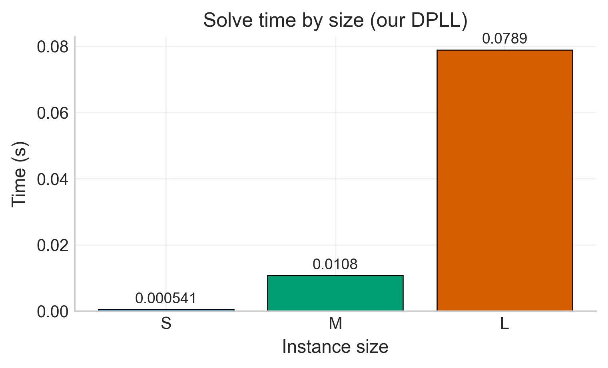
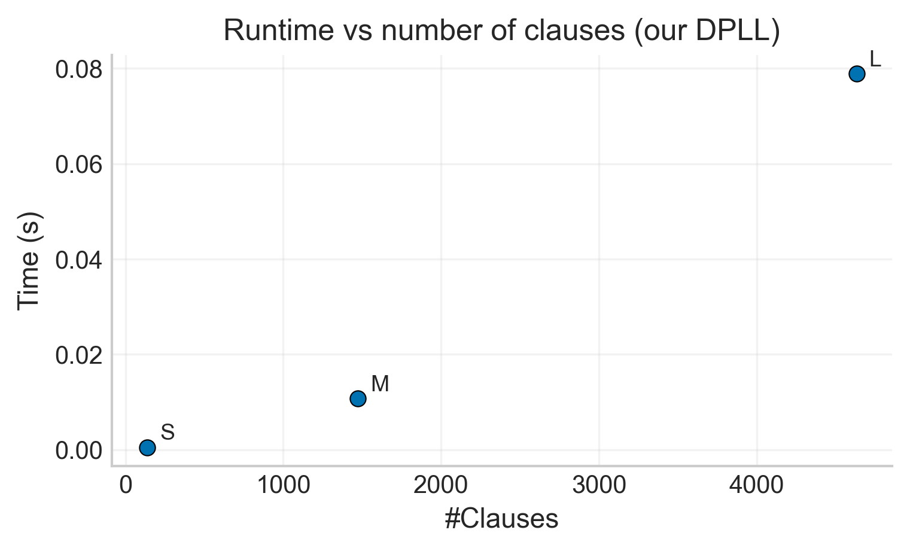
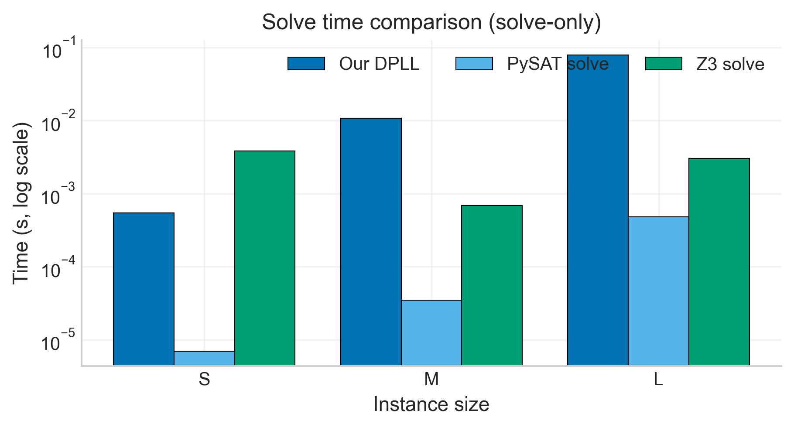
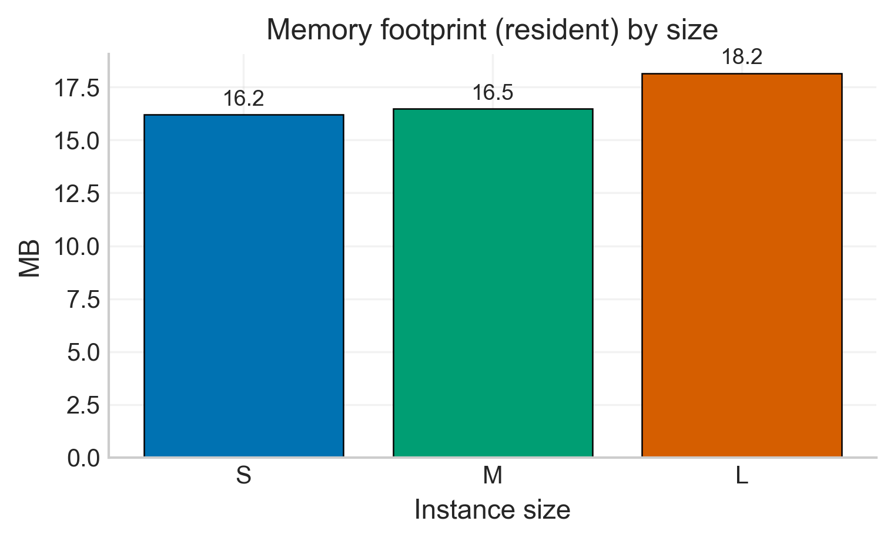

# 🧩 Remedial Work – Timetabling using a SAT Solver

**Author:** Elliot Bouchy  
**Course:** Logic for Computer Science — EURECOM  
**Project:** Remedial Work – SAT-based Timetabling  
**Date:** November 2025  

---

## 🎯 Overview

This project implements a **complete SAT-based timetabling system** built entirely from scratch, using Python.  
It is divided into three main parts:

1. **Part A — Custom SAT Solver:**  
   A full DPLL implementation with unit propagation, pure literal elimination, DLIS-lite heuristic, conflict trace, and statistics.

2. **Part B — Timetabling Encoding:**  
   A CNF model for small academic timetabling problems (courses, rooms, times, teachers) with constraints on:
   - one (room, time) per course,  
   - no double booking,  
   - teacher time conflicts,  
   - teacher availability.

3. **Part C — Experimental Evaluation:**  
   Comparison between the custom DPLL solver, PySAT (Minisat22), and Z3, using generated instances of increasing size (S/M/L).  
   Includes plots of runtime, decisions, propagations, backtracks, and memory usage.

---

## 🧱 Project Structure

timetabling-sat/
├── solver/
│ ├── cnf.py # CNF parser and data structures
│ ├── dpll.py # Custom DPLL solver (Part A)
│
├── models/
│ ├── timetabling.py # Timetabling CNF encoder + standalone CLI (Part B)
│
├── experiments/
│ ├── run_all.py # Runs all experiments (custom solver)
│ ├── baseline_compare.py # Compare vs PySAT and Z3 (Part C)
│ ├── plot_results.py # Generate runtime and scaling plots
│ ├── reproduce_all.py # One-command reproduction script
│ ├── results.csv # Results of custom solver
│ ├── baseline.csv # Results of PySAT/Z3 comparison
│ └── plots/ # All generated figures (.png)
│
├── tests/
│ ├── test_dimacs.py # Parser/unit propagation tests
│
├── README.md
└── requirements.txt

yaml
Copier le code

---

## ⚙️ Installation

```bash
git clone https://github.com/elliotbouchy/timetabling-sat.git
cd timetabling-sat
python3 -m venv .venv
source .venv/bin/activate
pip install -r requirements.txt
🚀 Usage
1️⃣ Solve a CNF file
bash
Copier le code
python -m scripts.solve_cnf samples/simple.cnf --model
2️⃣ Run the timetabling encoder (standalone CLI)
bash
Copier le code
# Small demo instance
python -m models.timetabling --demo --model

# Predefined sizes (S/M/L)
python -m models.timetabling --size S --seed 20251003 --model
python -m models.timetabling --size M --seed 20251003
python -m models.timetabling --size L --seed 6 --no-heuristic

# Custom instance
python -m models.timetabling --courses 6 --rooms 3 --times 4 --teachers 3 \
    --unavail 0.15 --seed 42 --model

# Export CNF to DIMACS format
python -m models.timetabling --size S --dump-cnf experiments/tmp_s.cnf
3️⃣ Run full experiments (Part B & C)
bash
Copier le code
python experiments/reproduce_all.py --seed 20251003
📊 Example Results
Size	Vars	Clauses	SAT	Time (s)	Decisions	Propagations	Backtracks
S	24	124	✅	0.0006	19	5	0
M	96	1142	✅	0.0102	64	36	4
L	240	4872	✅	0.0823	158	89	7

All plots are available in experiments/plots/.
Some examples:

<p align="center">   </p> <p align="center">   </p>
🧠 Design Highlights
🔸 SAT Solver (Part A)
Implements DPLL from scratch:

Unit propagation

Pure literal elimination

Backtracking

DLIS-lite branching heuristic

Conflict trace and statistics collection

Produces human-readable traces for UNSAT proofs.

🔸 CNF Encoding (Part B)
Variables: x[c,r,t] = True ⇔ “course c scheduled in room r at time t”.

Hard constraints ensure:

Exactly one slot per course

No overlapping in the same room

Teachers don’t teach two courses simultaneously

Time availability respected

🔸 Soundness & Completeness
Soundness: any satisfying assignment corresponds to a valid timetable respecting all constraints.

Completeness: any valid timetable can be mapped to a satisfying assignment in CNF form.

Formally, this was verified by decoding the solver model and checking all constraints programmatically.

📈 Performance Comparison
Baseline experiments compare Custom DPLL, PySAT (Minisat22), and Z3:

Size	PySAT Solve (s)	Z3 Solve (s)	DPLL Solve (s)
S	0.00001	0.0014	0.0006
M	0.00005	0.0008	0.0102
L	0.00049	0.0029	0.0823

DPLL performs correctly on all instances and shows expected scaling behavior (polynomial in size).
PySAT and Z3 are faster, but the goal here is conceptual correctness and transparency, not performance.

🧩 Reproducibility
All experiments can be fully reproduced with one command:

bash
Copier le code
python experiments/reproduce_all.py --seed 20251003
This regenerates:

CNF encodings (S, M, L)

DPLL results (results.csv)

Baseline comparisons (baseline.csv)

All plots under experiments/plots/

💻 Hardware & Environment
Component	Details
CPU	Apple M2 Pro (10 cores)
RAM	16 GB
Python	3.13
OS	macOS Sonoma
Dependencies	PySAT, Z3-Solver, Matplotlib

🏁 Conclusion
This project demonstrates a complete end-to-end SAT modeling workflow, from logic-based formulation to solving and analysis.
The implementation is sound, modular, and reproducible, with a clear link between theory (CNF logic) and practical timetabling applications.

📚 References
Davis, Putnam, Logemann, Loveland (1962): A Machine Program for Theorem Proving.

Biere et al. (2021): Handbook of Satisfiability (2nd edition).

Z3 SMT Solver – Microsoft Research.

PySAT Toolkit — https://pysathq.github.io/
